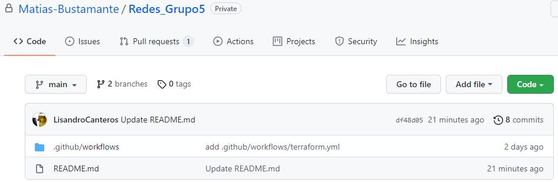

# Creación de una subnet con Terraform

 * [Introducción](#Introducción)
 * [Creando la subnet](#Declarando-la-subnet-y-asociándola-a-una-tabla-de-ruteo)
 * [Reglas de tráfico](#Definición-de-reglas-de-tráfico)
 * [Configurando instancia](#Configurando-la-subnet-en-la-instancia-EC2)
 * [Pull Request](#Pull-Request)
 * [Esquema](#Esquema)


## Introducción
El presente laboratorio consiste en crear una subnet en una VPC dada. Se nos brinda la VPC y el workflow de GitHub para desplegar la subnet.
Primero creamos un repositorio en GitHub e incluímos el workflow. 
<p align="center">
   <br>
  Fig.1 Creación del repositorio en GitHub
</p>

Este workflow utiliza una API Key, una Organización y un Workspace de Terraform Cloud. Estos datos son cargados en forma de secrets en el repositorio creado. 
<p align="center">
   <br>
  Fig. 2 Carga de secrets en repositorio
</p>

No tenemos acceso al archivo .tfvars que es donde se encuentran las variables de Terraform, pero podemos acceder a algunas de ellas anteponiendo var. al nombre de la variable.  Las variables a las que podemos acceder son: region, subnet1_zone_1a, ami_id, key1, instance_type, vpc1_id, internet_gateway_id.

## Declarando la subnet y asociándola a una tabla de ruteo
Dado que ya se nos brinda la VPC y el Internet Gateway (IGW) lo único que debemos hacer es crear la subnet y desplegarla. Comenzamos subdividiendo el rango de la VPC.
VPC (Main 1 VPC): 172.16.0.0/16
Decidimos utilizar 172.16.5.0/28 de manera que exista suficiente rango para las demás subredes que se vayan a crear en la VPC. Esto significa que el rango usable de IPs es 172.16.5.1/28 - 172.16.5.14/28, 14 hosts. 
Para definir la subnet en Terraform, creamos el archivo networking.tf y definimos el recurso, nombramos a la subnet “subnet5”:

```HCL
resource "aws_subnet" "subnet5" {
  vpc_id                  = var.vpc1_id
  cidr_block              = "172.16.5.0/28"
  map_public_ip_on_launch = true

  availability_zone = var.subnet1_zone_1a

  tags = {
    "Name" = "Subnet 5 | Main 1"
  }
}
```

También definimos la tabla de ruteo de la VPC, utilizamos la variables dadas vpc1_id e internet_gateway_id. La tabla de ruteo se llama “r”.

```HCL
resource "aws_route_table" "r" {
  vpc_id = var.vpc1_id
  route {
    cidr_block = "0.0.0.0/0"
    gateway_id = var.internet_gateway_id
  }
}
```

Para finalizar con este archivo, creamos la asociación entre la tabla de ruteo y la subnet creada. En este recurso debemos especificar el ID de nuestra subnet, la referenciamos escribiendo aws_subnet.subnet5.id. De igual manera debemos especificar la tabla de ruteo, aws_route_table.r.id. 

```HCL
resource "aws_route_table_association" "table_subnet1" {
  subnet_id      = aws_subnet.subnet5.id
  route_table_id = aws_route_table.r.id
}
```

## Definición de reglas de tráfico
Con eso habríamos terminado de editar el archivo networking.tf. Pasamos al archivo security_goups.tf y definimos las reglas de tráfico entrante y saliente. Por defecto, se rechaza todo tráfico por lo que hay que definir qué permitir. En nuestro caso, permitimos tráfico entrante HTTP y SSH y cualquier tráfico de salida, el “-1” en protocol significa que se permite cualquier protocolo. El recurso entonces se llamará “allow_http_ssh” y contendrá dos reglas.

```HCL
resource "aws_security_group" "allow_http_ssh" {
  name        = "allow_http_ssh"
  description = "Permite HTTP y SSH"
  vpc_id      = var.vpc1_id

  ingress {
    description = "SSH from Anywere"
    from_port   = 22
    to_port     = 22
    protocol    = "tcp"
    cidr_blocks = ["0.0.0.0/0"]
  }

  ingress {
    description = "HTTP from Anywere"
    from_port   = 80
    to_port     = 80
    protocol    = "tcp"
    cidr_blocks = ["0.0.0.0/0"]
  }

  egress {
    from_port        = 0
    to_port          = 0
    protocol         = "-1"
    cidr_blocks      = ["0.0.0.0/0"]
    ipv6_cidr_blocks = ["::/0"]
  }

  tags = {
    Name = "HTTP y SSH"
  }
}
```
## Configurando la subnet en la instancia EC2
Por último, debemos modificar el archivo instance.tf. Es necesario definir el ID de la AMI, tipo de instancia y el ID de la subnet que creamos. Luego hay que especificar el ID de la regla que creamos en el security group, nuestra regla, [aws_security_group.allow_http_ssh.id], este atributo es una lista porque se podrían haber definido más reglas o incluso creado una regla para HTTP y otra para SSH. El atributo private_ip requiere que elijamos una IP dentro del rango de la subnet creada, definimos 172.16.5.5/28. Por último, especificar la clave registrada en amazon para el acceso a la instancia, no la tenemos pero accedemos con var.key1.

```HCL
resource "aws_instance" "server1" {
  ami                         = var.ami_id
  instance_type               = var.instance_type
  subnet_id                   = aws_subnet.subnet5.id
  associate_public_ip_address = true
  vpc_security_group_ids      = [aws_security_group.allow_http_ssh.id]
  private_ip                  = "172.16.5.5/28"
  key_name                    = var.key1
  user_data                   = file("user-data.sh")

  tags = {
    Name        = "server-1"
    Owner       = "student_5"
    Environment = "develop"
    OS          = "amazon-linux"
  }
}
```
## Pull Request
Una vez realizados los cambios mencionados, realizamos un Pull Request para revisión, corrección y posterior unión a la rama principal del repositorio (main).
Los demás archivos no fueron modificados en este laboratorio. 
<p align="center">
   <br>
  Fig. 3 Esquema de la VPC al finalizar el laboratorio.
</p>

## Esquema
Finalmente presentamos el esquema de la VPC luego de introducir la subnet. Solo modelamos una subnet dado que no conocemos las subnets de los demás grupos
<p align="center">
   <br>
  Fig. 4 Esquema de la VPC al finalizar el laboratorio.
</p>
